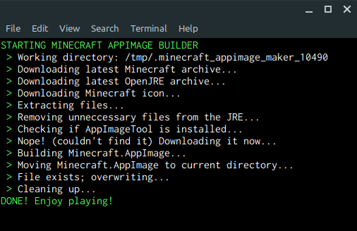

# Minecraft AppImage Maker
A simple BASH script to build an AppImage (portable installation) of Minecraft using the latest launcher from the official site.<br/>



## To create the AppImage without downloading the script:
```bash
curl 'https://raw.githubusercontent.com/mgord9518/minecraft_appimage_maker/main/minecraft-appimage-maker.bash' | bash
```
To make the saves portable as well, instead of the default '~/.minecraft', make a new folder in the same directory as the AppImage called 'Minecraft.AppImage.home' or run:
```bash
./Minecraft.AppImage --appimage-portable-home
```
